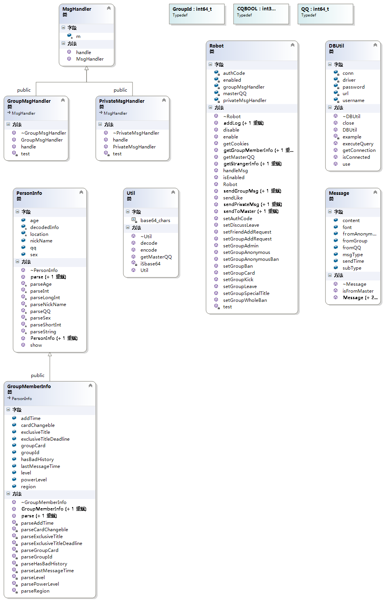
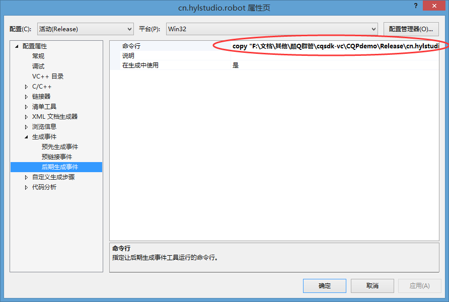

简介
----
使用 C++ 编写QQ机器人  
假期刚开始写。。。架构将逐步趋于完美，短期内有些问题请无视=_=||

作者
----
hyl：[https://github.com/956237586/](https://github.com/956237586/)      
zhr：[https://github.com/ZHRMoe](https://github.com/ZHRMoe)  
lz(臻弯):[https://github.com/Liz0797](https://github.com/Liz0797)

架构说明
--------
本项目全部采用面向对象思想进行封装编写，Everything is an object~~  
23333333如果你看不懂我在写什么，请出门右转进入易语言开发QQ群(`325405886`)，慢走不送~~ 

开发工具
-------
VS2015

文件说明
--------
`CQPdemo.sln` - 示例项目，可以直接在此基础上编写应用
使用vs即可直接导入项目  

可以编译为 `cn.hylstudio.robot.dll`，与 `CQPdemo/cn.hylstudio.robot.json` 一起放置在酷Q的app目录下测试

`CQPdemo/cn.hylstudio.robot.json` - 样例应用的对应信息文件，包含应用的基础信息、事件列表等，请放置在酷Q的app目录下（无需使用的事件、菜单、权限请在此删除）

`CQPdemo/cqp.h` - 酷Q SDK 头文件，通常无需修改

`Robot.h`头文件中定义了机器人类。如果需要其他类来组合机器人类，请仿照本文件开头的写法进行其他类的编写。

`CQPdemo/CQP.lib` - CQP.dll 的动态连接 .lib 文件，便于C、C++等调用 酷Q 的方法。

注意
--------
**如图，我在生成解决方案之后加了个控制台的复制命令，生成的文件在项目目录下的outputFiles里**  
**打开SetupPath.bat更改你机器人主程序的目录即可实现生成后自动复制**

官方网站
--------
[主站](https://cqp.cc)：https://cqp.cc

[文库](https://d.cqp.cc)：https://d.cqp.cc